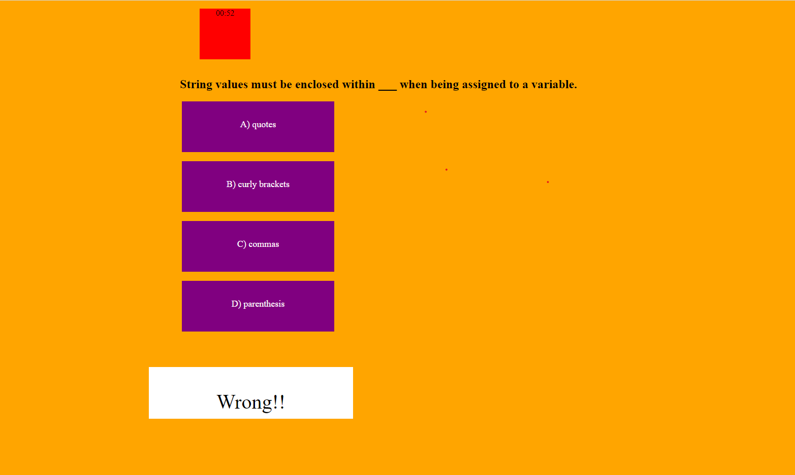

This is my code quiz project. Inside the project, you will find a page where you are asked to start the quiz. Once this button is clicked, a timer for 100 seconds is launched, and the players have 5 quiz questions to answer before recieving their score. The player score at the end is the amount of time remaining on the timer, factoring in a 10 second timer penalty for each wrong answer. 

[Link to deployed app](https://maxdamoe.github.io/CodeQuizProject/)
